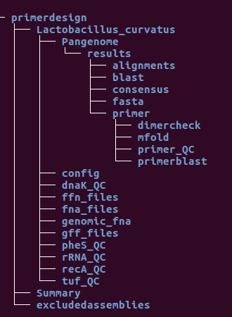

## Primerdesign

### First run
A good starting point is to go to Primer design and click the "new" button.
Choose a target (e.g. __Lactobacillus curvatus__) and use the default value for the path.  
In the settings at least the quality control gene(s) and the assembly level have to be specified (for assembly level e.g. "__all__" and "__tuf__" for quality control genes), for the other settings the default values are good to start.  10 - 200 genome assemblies are good as a starting point.

* Click submit to save the settings and then start the pipeline by clicking the "Start pipeline" button.
* The link below allows to track the pipeline log in the browser window (the log file is stored in your HOST primerdesign directory)

The log file of the pipeline run is saved in the primerdesign directory. After the run has finished you will find a Summary directory in the primerdesign directory with one directory for each species. The selected configuration for the pipeline run is saved in a json file in the config directory and is also copied to the summary directory after the run has finished.

If you want to start the pipeline in a terminal type:

		$ sudo docker exec -it {containername} speciesprimer.py
		
Answer all the questions and start the run.

* __Example:__
__/home/biologger/primerdesign/Summary/Lactobacillus_curvatus__
In there you will find:
	* a list with designed primers 	
		* __Lb_curva_primer.csv__
	
	* statistics and a summary of the initial quality control of the genome assemblies 
		
		* __Lb_curva_pipeline_stats_2018_04_29.txt__
		* __Lb_curva_qc_sequences.csv__
		
	* the phylogeny files (if skip_tree = False)
		* __core_gene_alignment.aln__
		* __Lb_curva_tree.newick__
		
	* the configuration file
	
		* __config_2018_04_29.json__
		
The newick tree can be opened for example with seaview (http://doua.prabi.fr/software/seaview).

The configuration selected for the pipeline run is also saved in the  
__/home/biologger/primerdesign/Lactobacillus_curvatus/config/config.json__ file.

If no primer pairs were found or problems occur during the run, check your input genomes (their quality is crucial) and the troubleshooting section.

### Directory tree

In the container the directory "primerdesign" is the starting directory, on the host it is the directory you specified in the initial docker run command. In there are directories for each target species, a Summary directory and an excludedassemblies directory. In the summary directory the results of the pipeline runs are saved for each target species separately. In the excludedassemblies directory the prokka annotation files of assemblies which did not pass the quality control are saved for each species separately. You can delete the directories with the annotation files if you want to save hard disk space. The information is still saved in the text file in the target species directory.

### Using user provided genomes
* Names of input fasta files should not contain dots and not more than one underscore.
1. Start the batchassist.py script and step through the configuration. 
2. In the primerdesign directory on the host you now see directories with the species names containing a config and a genomic_fna directory.
3. Copy your genome fasta files into the genomic_fna directory

Alternative 1:

* Create the required directories and copy your genome files into it.

* __Example:__

	* Container
	
			$ mkdir /primerdesign/Lactobacillus_curvatus
			$ mkdir /primerdesign/Lactobacillus_curvatus/genomic_fna
			$ cp /primerdesign/mygenomes/* /primerdesign/Lactobacillus_curvatus/genomic_fna

			# Start a normal run
			$ speciesprimer.py
			$ n # start a new run (hit return)
			# working directory
			$ /primerdesign/
			# target
			$ Lactobacillus curvatus
			$ ...
			

Alternative 2:

* Run the pipeline GUI with selected offline option until it breaks (because no genomes were found). Then add your genome fasta files to the genomic_fna directory.
* If you want to use also NCBI genomes change the settings back to online, otherwise just start the pipeline again.

Using your own prokka annotated files is not recommended. Depending on the version of prokka some gene names could have changed, this can cause problems during the quality control and the pan-genome analysis. The name convention has to be exactly the same for all input genomes, errors there can lead to a variety of strange errors during the pipeline run.

### batchassist.py
The batchassist.py script creates configuration files for future primer search. 
It offers individual or global selection of the command line options for multiple target species.  

To start the pipeline with this configuration files, use speciesprimer.py
and choose "start" (s) and then (a)ll or (s)elect, to start primer search for all species or to select certain target species.

__Example:__ search primer pairs for all species (without a primer.csv file) with a configuration file 

* __CONTAINER:__

		$ speciesprimer.py
		$ s # (hit return)
		$ a # (hit return)
		
		
### Additional info blastseqs option

from https://www.ncbi.nlm.nih.gov/books/NBK279668/ accessed 15.05.2019

#### Concatenation of queries

BLAST works more efficiently if it scans the database once for multiple queries. 

This feature is known as concatenation. It speeds up MegaBLAST searches the most as they spend little time on tasks that consume CPU and most of the time streaming through the database. BLASTN and discontiguous MegaBLAST searches also run faster with concatenation, though the effect is less pronounced. BLAST+ applies concatenation 
on all types of searches (e.g., also BLASTP, etc.), and it can be very beneficial if the input is a large number of queries in FASTA format. BLAST+ concatenates queries by grouping them together until a specific number of letters (or “chunk size”) is reached. Unfortunately, a constant chunk size for each database scan causes certain problems. For some searches the chunk size is too large, too many letters are searched at once, and the process consumes too much memory. Tests have shown that the number of successful ungapped extensions performed in the preliminary stage is a good predictor of overall memory use during a search. The BLASTN application (starting with the 2.2.28 release) takes advantage of this insight to provide an “adaptive chunk size”. The application starts with a low initial chunk size of 10,000 bases and records how many successful ungapped extensions were performed during search. It adjusts the chunk size on the next database scan with a target of performing two million extensions during the search.

Query concatenation also means that BLAST will produce no output until the first set of concatenated queries have been processed. Some users find this disconcerting, but it is not a problem.		